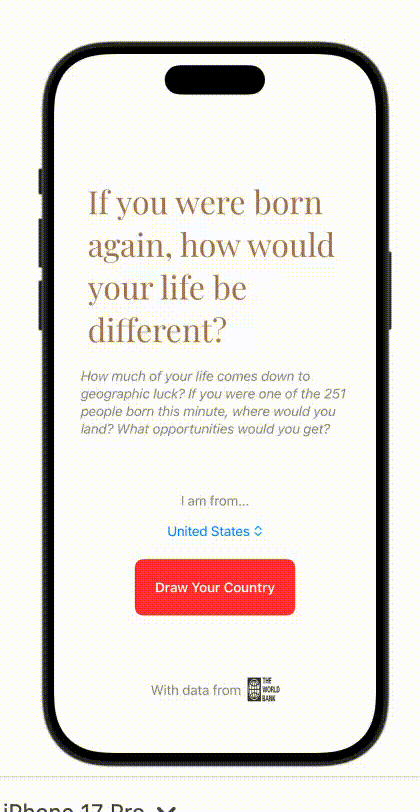

# Birth Lottery
<h1>How much of your life comes down to geographic luck? If you were one of the 251 people born this minute, where would you land? What opportunities would you get?</h1>

Spin the wheel, land somewhere on Earth, see what that means for your life. This app simulates the “birth lottery” — randomly assigning a country of birth based current population data, and showing key statistics tied to that outcome.

I was inspired to create this after learning about the idea of a birth lottery in one of my first-year classes. It's meant to illustrate that how something as random as where you are born can impact your opportunities and life outcomes. You can also input your own country of origin and compare your actual birthplace stats against your randomly assigned one.

<h2>The Process</h2>

I used data from the World Bank API, including GDP per capita, life expectancy at birth, child mortality rate, gini index, and GDP per capita. The most challenging part was dealing with inconsistent data coverage across countries and years and missing values for smaller nations. Learning how to work with complex JSONs and clean data was an excersize in patience and problem solving!

 

